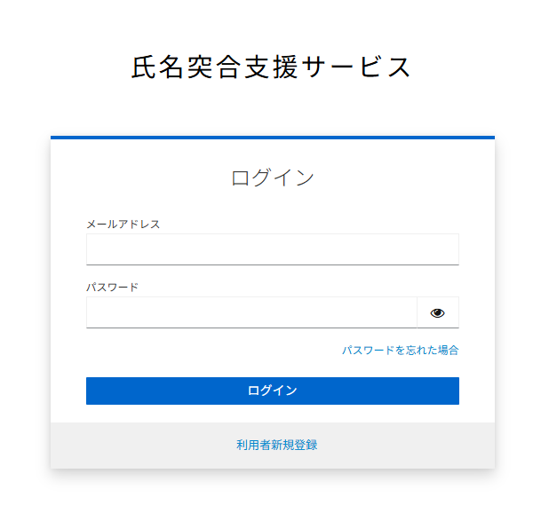

# 氏名突合支援サービス API利用サンプル

## 概要

本リポジトリでは、デジタル庁が提供する氏名突合支援サービスの API 利用時のサンプルコードを提供しています。

API 仕様の詳細については[サポートサイト](https://kktg.digital.go.jp/support/index.html)を参照ください。

## サンプルコード

以下環境向けのサンプルコードを提供しています。

使用方法は、各サンプルコード付属の README を参照してください。

- [Java](./samples/java/)
- [Node.js](./samples/nodejs/)
- [Python](./samples/python3/)
- [Vue.js](./samples/vue3/)
- [Excel](./samples/excel/)

## API の利用手順

### 登録

[氏名突合支援サービスサポートサイト](https://kktg.digital.go.jp/)にアクセスし、取得してください。

初めて利用する場合には、[利用者新規登録] ボタンを押して、新規登録を行い、API キーを取得してください。

すでに登録済みの場合には、https://kktg.digital.go.jp/ から、[ログイン] ボタンを押して、API キーを取得してください。



### 実行

サンプルコードで実行する場合には、各サンプルコード付属の README に従い、環境を準備してください。

ここでは一番簡単に試すことができるコマンドラインツール `curl` での実行例を以下に示します。

#### 具体例 1

漢字氏名 `日本　太郎` とカナ氏名 `ニホン　タロウ` の氏名突合を行う場合

```
// リクエスト (REPLACE_WITH_YOUR_API_KEY は取得したAPIキーで置き換えてください)
curl --get --data-urlencode "kanji=日本　太郎" --data-urlencode "kana=ニホン　タロウ" -d "key=REPLACE_WITH_YOUR_API_KEY" https://api.kktg.digital.go.jp/v1/simple
```

```
// レスポンス
{
    "response": "OK",
    "result": {
        "status": 90
    },
    "version": "1.6o"
}
```

`"status": 90` は、`高い確率で、正しい読み方だろう` と意味します。

#### 具体例 2

漢字氏名 `日本　太郎` とカナ氏名 `ジャポン　タロウ` の氏名突合を行う場合

```
// リクエスト (REPLACE_WITH_YOUR_API_KEY は取得したAPIキーで置き換えてください)
curl --get --data-urlencode "kanji=日本　太郎" --data-urlencode "kana=ジャポン　タロウ" -d "key=REPLACE_WITH_YOUR_API_KEY" https://api.kktg.digital.go.jp/v1/simple
```

```
// レスポンス
{
    "response": "OK",
    "result": {
        "status": 0
    },
    "version": "1.6o"
}
```

`"status": 0` は、`高い確率で、正しくない読み方だろう` と意味します。

### 出力

API からの戻り値は JSON 形式で返却されます。`status` の項目が判定結果を表し、`0` から `99` の値を取ります。

`status` の意味は下表のとおりです。

`status` が `50` 以上の場合、`漢字氏名とカナ氏名が一致している` と判定することを推奨しています。

| status | 意味 |
|-|-|
| 90 | 簡易モデルのみで漢字氏名とカナ氏名が一致していると判定 |
| 80 | 簡易モデルではNGだが、詳細モデルの3つのモデル全てで一致していると判定 |
| 70 | 簡易モデルではNGだが、詳細モデルの2つのモデル全てで一致していると判定 |
| 30 | 簡易モデルではNGだが、詳細モデルの1つのモデル全てで一致していると判定 |
|  0 | 簡易モデル、詳細モデルの全てで一致していないと判定 |

