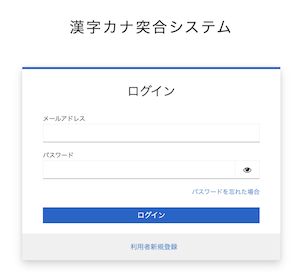

# 漢字かな突合システム

## 説明

入力された名前文字列と読み仮名（フリガナ）を、デジタル庁が用意した名前突合システムの辞書データと突合し、読み仮名（フリガナ）が正しいかどうかを統計的に判断します。

## 具体例1

「kanji=日本 太郎」「kana=ニホン　タロウ」を与えた場合のレスポンスは以下の通りです。

```
curl --get --data-urlencode "kanji=日本　太郎" --data-urlencode "kana=ニホン　タロウ" -d "key=(api key)" https://api.trueno-kktg.digital.go.jp/v1/simple

{
    "response": "OK",
    "result": {
        "status": 90
    },
    "version": "1.6o"
}
```

`"status": 90` は、`90%の確率で正しい読み方だろう` と意味します。


## 具体例2

「kanji=日本 太郎」「kana=ジャポン　タロウ」を与えた場合のレスポンスは以下の通りです。

```
curl --get --data-urlencode "kanji=日本　太郎" --data-urlencode "kana=ジャポン　タロウ" -d "key=(api key)" https://api.trueno-kktg.digital.go.jp/v1/simple

{
    "response": "OK",
    "result": {
        "status": 0
    },
    "version": "1.6o"
}
```

`"status": 0` は、`0%の確率で正しい読み方だろう (つまり、正しい読み方ではなさそう)` と意味します。

## APIキーの取得

https://kktg.digital.go.jp/ から、[ログイン]ボタンを押して、ユーザー登録を行ってください。



※「利用者新規登録」から新規登録をすることができます

## サンプルコード

- [node.js](./samples/nodejs/)
- [python3](./samples/python3/)
- [vue3](./samples/vue3/)
